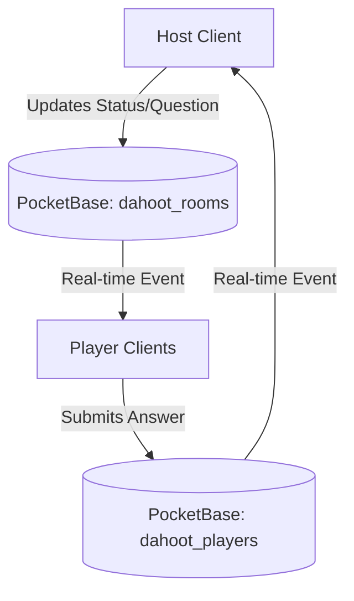
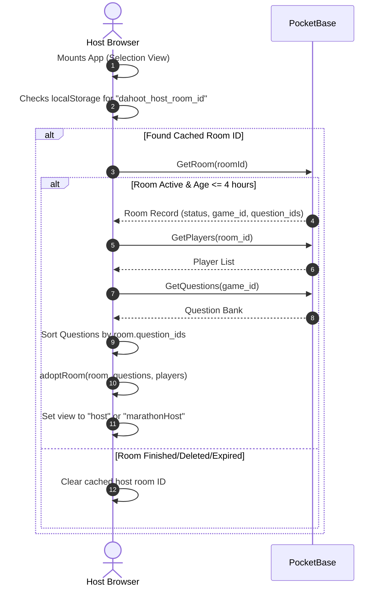

# Dahoot Gameplay & Session Recovery Architecture

This document describes the design, real-time synchronization, and reconnection/recovery architecture for both game hosts and players in Dahoot.

---

## 1. Core Synchronization Architecture
Dahoot utilizes a client-server sync model backed by **PocketBase** real-time subscriptions. All game state transitions originate from the Host and propagate to Players via collection events.

### Key PocketBase Collections
1. **`dahoot_rooms`**: Stores the room status (`LOBBY`, `QUESTION`, `LEADERBOARD`, `FINISHED`, `WRAP_UP`), active game ID, current question index, start timestamp, timer duration, and the custom-ordered list of question IDs (`question_ids`).
2. **`dahoot_players`**: Stores player records (room relation, name, score, answer map, and marathon-specific telemetry).
3. **`dahoot_questions`**: Read-only bank of questions parsed by game ID.

---

## 2. Reconnection & State Recovery Flow
To protect gameplay from temporary network drops or accidental browser reloads, Dahoot implements a client-driven session recovery system using `localStorage`.

### Host Reconnection Flow
The host's active room ID is stored locally. If a refresh occurs, the host client fetches the room record, players, and questions, rebuilds the active context, and resumes the dashboard.

### Player Reconnection Flow
Players follow a similar flow. Their local credentials (`dahoot_player_id` and `dahoot_room_id`) are cached on join. Upon reconnection, the player's last answers and feedback state are restored so they don't lose points or choice states on refresh.

---

## 3. Storage and Security Design
During design, we analyzed two approaches for restoring host state:
1. **URL Query Parameters (`?hostRoomId=...`)**:
   * *Risk*: High risk of privilege escalation. Hosts showing their screen or copying the address bar URL to share with students would unintentionally expose the host controller dashboard.
2. **Local Browser Cache (`localStorage`) (Chosen)**:
   * *Security*: Highly secure. The room ID is locked to the specific browser instance that launched the game.
   * *User Experience*: Seamless and invisible. The URL remains clean (`/` or `?pin=XXXX` for player redirection).

---

## 4. Lifecycles and Cleanup

### Standard vs. Marathon Modes
* **Standard Hosting**: Synchronous pacing. The host advances questions. When the host deletes or finishes the room, the room record is destroyed (`dahoot_rooms` delete cascades to players), and `localStorage` is purged.
* **Marathon Hosting**: Student-paced. Host sets up the lobby and monitors stats in real-time. Reconnection ensures the host can monitor late joins and view live leaderboard updates.

### Session Expiry Threshold
To prevent users from being trapped in dead sessions from previous days:
* **Host**: Sessions are ignored and cleared from cache if the room creation time is greater than **4 hours**.
* **Player**: Sessions are cleared if the corresponding room has been deleted in PocketBase (reconnect fails).
